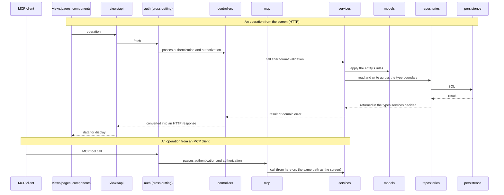

# Standard Architecture

The structure adopted for every personal product, put into words so that it does not have to be explained again per project. The aim is that handing this document over at the start of a new project completes the agreement on the code's skeleton.

## Origins

Nothing here is invented. It is a combination of proven patterns.

- The backend is a layered architecture: the Service Layer and Repository patterns, both from Fowler, Patterns of Enterprise Application Architecture.
- The dependency discipline is borrowed from onion architecture. The domain model sits at the center, dependencies always point inward, and the circumstances of the outside never propagate inward.
- Views are a simplified Atomic Design. The strict five levels (atoms, molecules, organisms, templates, pages) are not adopted because time dissolves into classification debates; they are loosened to three.

## Structure

```
src/
├── models/        # Domain model. Entity types and entity-specific rules. A pure, environment-independent layer
├── controllers/   # Request interpretation and response shaping only. Holds no logic
├── services/      # The body of the business logic. Shared by every entry point (HTTP, MCP, ...)
├── repositories/  # Persistence access. Knowledge of SQL and external storage is confined here
└── views/         # The only part that goes through the browser build
    ├── pages/       # Screens, one per route
    ├── components/  # Assembled parts that know the domain
    ├── parts/       # Plain parts that do not know the domain (Button, Input, Card, ...)
    ├── api/         # The layer that calls the server API. fetch is confined here
    └── assets/      # Static assets: images, animation data, fonts
```

Layers are added as the product's nature requires.

- An entry point such as `mcp/` (MCP tool definitions) is a sibling of `controllers/`: a thin layer that always calls services directly and holds no logic. An entry point never calls another entry point.
- A cross-cutting layer such as `auth/` is not an entry point. It works as middleware placed in front of the entry points.
- When an external service's API has to be called, stand up `gateways/`. It is an adapter of the same rank as repositories, which talk to persistence: knowledge of the outside world, such as URLs, authentication and retries, is confined there.

## Dependency rules

The center is models and services, and dependencies flow one way, from the outside in.

- Entry points such as controllers and mcp call services. Services do not know the entry points.
- Services use repositories and gateways across a type boundary and do not know the kind of database, the shape of the SQL, or the external API's specification. The boundary types are decided by the side that uses them, services, and repositories and gateways conform to them. A separate interface file is not written until swapping the implementation becomes real; the type a service needs is declared in the service's own file.
- Services never import repositories or gateways. They receive the implementation as an argument, and the implementations are assembled and handed over in one place, the entry file that starts the application (the composition root). Entry points do not assemble them either: once each entry point builds its own repositories, the knowledge of the wiring is copied once per entry point.
- Views communicate with the server side only through `views/api`. They do not know the server's internal structure.
- Models depend on nothing. They are a layer of types and rules that knows neither the database nor the DOM, and keeping that purity is what lets the server-side layers and the views' pages, components and api refer to the same types across the build boundary. Parts do not know the domain by their classification rule, so a part that refers to models belongs in components from that moment.

The purpose of these rules is to minimize how far a change propagates. Replacing the database stops at repositories, renewing the UI stops at views, and adding an entry point (a new API, a new MCP tool) does not touch the business logic. Conversely, a change to a business rule is made in one place in services, and every entry point sees the same change automatically.

## How the layers relate



The diagram makes three points. The entry points (controllers, mcp) stand side by side and both call services directly; an entry point never calls another. Auth sits in front of every entry point on the path in the same way. And everything past services (models, repositories) does not know which entry point the operation came from.

## Discipline of each layer

- Service files are split by feature, in units of use cases such as carry-over, review, or judgment. Splitting by entity (GoalService and the like) is not adopted because such a file attracts related processing and bloats. Keep it true that a change touching one feature closes within one file.
- Entity-specific rules shared by several features, such as constraints on state transitions, live in models. When copying between feature services begins, that is the sign the rule was put in the wrong place.
- Validation is split in two. Validation of form (required fields, types, whether a date is valid) happens at the entry point, such as controllers. Validation of business rules (whether this state transition is allowed) happens in services.
- Errors follow the same division. Services throw domain errors, and the entry point converts them into a representation such as an HTTP status. However many entry points are added, this conversion is the only thing each one carries.
- A library belongs to the layer where the knowledge it embodies lives: HTTP knowledge in the entry file and the entry points, screen knowledge in views, SDKs for persistence or external APIs in repositories or gateways. A library's own types and formats do not leak outside that layer; they are converted inside it into the types the inner side decided before being handed over. Each layer is itself that kind of converter to the outside world, so no layer is stood up only for conversion. Gateways are limited to external services across the network; neither gateways nor new layers are added for the convenience of a local library. As a rule models take no library, to protect their purity.
- When a colorless, pure, shared function that belongs to no layer's knowledge actually comes into being, stand up `lib/`, added on need like gateways. Nothing that carries a layer's knowledge flows into `lib/`. Only what failed every layer's checkpoint goes there: is it a rule of an entity (models), a procedure of the business (services), a tool of the screen (views/parts)?

## Classifying view parts

Parts are sorted with one question: **does this part know the domain, meaning what this product is?**

- It does not: `parts`. A plain part containing no product name and no domain vocabulary, one that could be carried into any project.
- It does: `components`. A part that assembles parts and gives them the domain's meaning.
- It is a unit of routing: `pages`. It arranges components into a screen.

The sorting ends with this one question, so no debate about hierarchy arises.

## Where this applies

This assumes a small-to-medium product that fits in a single deployment target. At a scale that needs splitting into several services, or contracts on module boundaries for teams working in parallel, the product is beyond this document's range and is designed separately.
